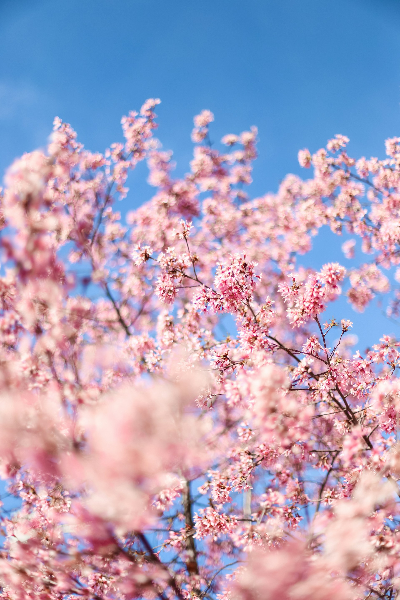

# 🌸 Digital Spring: Embracing New Beginnings 🌸

Welcome to this digital greeting card project! 🎉
We will learn together how to create a greeting card with HTML and CSS. 🌼

## What do we want to achieve?

Your greeting card can be a beautiful way to show your care for someone. A greeting card in general can have different layouts. We decided that we want to create **a greeting card with a flip effect**.

Therefore, our **greeting card** will have two sides. The **front side** will show a beautiful image, a greeting text (or something else you want to say) and some animated bees. The **back side** will have your message for the recipient. 💌
Only **one side of the card will be visible** at a time. The recipent needs to click (or touch for mobile devices) the card to flip it. 🔄

During our journey, we will learn more **about HTML and CSS**. We will learn how to **structure our card** with HTML, how to **style** it with CSS, and how to add **animations** to it. 🎨

In the end we will have a beautiful greeting card. 🐝

## Who do we want to reach with our greeting card?

A greeting card could have multiple purposes: to celebrate a special occasion, to express gratitude, to send well wishes, or to simply say hello. 💌 It is up to you to decide what you want to express with your greeting card. 🌸

But you will show to the recipients of your card that you care about them and that you took the time to create something for them with HTML and CSS. 🎨

## What do we need to get started?

To create our greeting card, **we need a code editor, a web browser, and some images**. The basic setup is already created by your coach. You only need to copy the project and can then start coding. 🚀
We have also prepared some images for you. You can use them for your greeting card or you can use your own images. 🖼 And we have also more assets for you: some flowers and bees. 🌼🐝

We will work with an online code editor called **CodeSandbox**. You need to have an account on CodeSandbox to save your project. If you don't have an account yet, you can create one for free.

**Why do we want to use an online editor?**

- CodeSandbox is a nice tool to create and share web projects. 🌐
- We will have an easy way to share our project with others. 🤝

## How is this project structured?

We have set up the project for you and we can start coding right away. 🎉
But let us briefly explain what the files and folders are for. 📁

Since we only have a limited time frame to build the card, there are already some stylings and some JavaScript code that we have prepared. The basic structure of the HTML is also already build.
If you want to look at the stylings later, you can find them in the `.where-the-magic-is` folder. 📝

The main files and folder that we will work with are:

- **index.html**: This is the main file of our project. We will structure our greeting card here.
- **styles.css**: This file contains the styles for our greeting card. We will style our card here.
- **assets**: Images and all the other assets that you can use for your greeting card are in the `assets` folder. 🖼

The `.gitignore`, `package.json`, `package-lock.json` and `sandbox.config.json` contain some configurations for and information about the project. You don't need to worry about them. 🚀

The `README.md` file contains information about the project. You are reading it right now. 📖

That's it! 🎉 So let's start coding! 🚀

## How can we create our greeting card?

We will create our greeting card step by step. We will start with writing HTML to structure our card, then we will style it with CSS, and finally we will add some animations. 🎨

## Guide 📜

## Step 1: Structure the greeting card with HTML

The first thing we want to do is to structure our greeting card with **HTML**.

### What is HTML?

- HTML is short for `HyperText Markup Language`.
- It is giving content on websites `meaning and structure`. You can imagine HTML as the skeleton or the most basic building block of the Web.

Let's analyze the word for more
clarification:

- `Hypertext`: Refers to the ability of HTML to create links that link one webpage to another. (Either on a single website or in between different websites.) This is a fundamental aspect of the web and the idea behind the "world wide" interconnection.
- `Markup Language`: Refers to a syntax that uses specific elements to structure or format a document.

**When we write HTML we use the following terms:**

- `HTML element`: Every piece of content in a HTML document is placed inside of a HTML element. **HTML elements** are the building blocks of HTML pages.

- `HTML tags`: The elements are written in form of HTML tags, meaning surrounded by `<>` and
  `</>`.
- `HTML attributes`: Some HTML elements need additional information in order to work properly. This information is given by HTML attributes.

### Code

We will start by creating the basic structure of our greeting card. We add the content for both sides of the card and separate the content for the front and back side of the card.

```html
<main>
  <section>
    <h1>Tech in den Mai</h1>
  </section>
  <section>
    <h2>Lieber Mensch,</h2>
    <p>
      der Mai ist endlich da! Und was gibt es besseres als jetzt etwas Neues zu
      lernen?
    </p>
    <p>
      Ich habe mir gedacht, dass du dich bestimmt über Grüße von mir freuen
      würdest. Deshalb schicke ich dir diese digitale Postkarte.
    </p>
    <p>
      Alles Liebe <br />
      Mareike
    </p>
  </section>
</main>
```

### Semantic HTML

When we write HTML, we always want to make sure that we use the correct HTML elements for the correct purpose. This is called `semantic HTML`. Semantic HTML means that we use HTML elements for their intended purpose. For example, we use a `<h1>` element for the main headline of our page, a `<p>` element for paragraphs and so on.

**The benefits of writing semantic HTML are:**

- `accessibility`: Screenreaders can function much better with semantic HTML, which can help e.g. visually impaired users to navigate the webpage and have a better user experience.
- `SEO`: It's relevant for search engines to evaluate the importance and the context of the different parts of a web page.
- `readability`: It's easier for other developers to understand your code. And also for yourself in the future!

## Step 2: Style Fonts with CSS Classes

The basic structure of our card is done for now. 🚀 Now we want to add some styles to make it look nice. 💅 To achieve this, we will use CSS.

### What is CSS?

**CSS means Cascading Stylesheets**. While HTML defines the structure and semantics of your content, we use CSS for design and layout.

Let's analyze the word for more clarification:

- `Cascading`: CSS rules are applied in a cascading manner. This means that the order of the rules is important. If there are conflicting rules, the last one will be applied.
- `Stylesheets`: CSS rules are written in a stylesheet. This is a separate file that is linked to the HTML document. This way, we can separate the content from the design.

**When we write CSS we use the following terms:**

- `selector`: A CSS selector is used to specify the elements to which CSS rules apply.
- `property`: Name for a particular property to which a value is attributed.
- `value`: The value we assign to a property.
- `declaration`: Each pair of property and value is a declaration.
- `rule`: A rule consists of one or more declarations. It is written in the following way: `selector { property: value; }`

Today we will only work with one type of selector, which is the `class selector`. We will use classes to style our HTML elements. To achieve this, we need to add a `class` attribute to the HTML element we want to style. The value of the class attribute is the name of the class we want to use. We can use the same class for multiple elements.

### Code

The first thing we want to do is to add a class to the `<h1>` element in our `styles.css` file. We will use the class `headline` for this element. We want to change the font family, the color and the background color of the headline. To achieve this, we need to do the following:

```css
.headline {
  color: rebeccapurple;
  font-family: "Rye", sans-serif;
  background-color: peachpuff;
}
```

Within this project we have already added some fonts that you can use:

- `Allison`
- `Amatic SC`
- `Dosis`
- `Handlee`
- `Londrina Shadow`
- `Open Sans`
- `Playfair Display`
- `Rye`

Nevertheless, there are also some web safe fonts that you can use like `Helvetica`, `Gill Sans` or `Baskerville`. Web safe fonts means that they are available on most operating systems and browsers. Feel free to try them out!

## Step 3: Split card content into two sections

We need the predefined classes `.card`, `.front` and `.back` to be added to their respective tags in order to apply our global styles:

- `.card` gives padding, sets the size of the card and is what will be flipped
- `.front` applies basic styling and positions the front of the magic holiday card
- `.back` gets rotated and flipped to the back

### Code

```html
<main class="card">
  <section class="front">
    <h1 class="headline">Digital Spring</h1>
  </section>
  <section class="back">
    <h2>Lieber Mensch,</h2>
    <p>
      der Frühling ist endlich da! Und was gibt es besseres als in dieser Zeit
      etwas Neues zu lernen?
    </p>
    <p>
      Ich habe mir gedacht, dass du dich bestimmt über Grüße von mir freuen
      würdest. Deshalb habe ich dir diese digitale Postkarte geschrieben.
    </p>
    <p>
      Alles Liebe <br />
      Mareike
    </p>
  </section>
</main>
```

> 💡 This _hides_ the back of the card. This might be surprising but is what we want.

## Step 4: Add the flip effect

If you click around you will see that the card is not turning yet. We need to add some CSS. We already implemented the needed JavaScript code for you. 🎉

### But first: What is JavaScript?

**JavaScript** is used to make websites interactive. We will use JavaScript to add a flip effect to our card. JavaScript is a programming language that is used to create and control dynamic website content.

We want to add a flip effect to our card. This means that when we click on the card, it should turn around and show the back side of the card.

### Code

```css
.flipcard {
  transform: rotateY(180deg);
}
```

With `transform: rotateY(180deg);` we rotate the card around the y-axis by 180 degrees. This will make the card turn around and show the back side.

> 💡 `transform` is a CSS property that allows us to rotate, scale, skew, or move an element. In this case, we rotate the card around the y-axis.

When you now click on the card you will see that it is turning! Yay. :)

## Step 5: Add an image as background for the front side

We want to add a beautiful image as background for the front side of our card. You can use one of the images we have prepared for you. 🖼

### Code

```html

```

> 💡 `.postcardimage` is a prepared CSS class that makes the image cover the front of the card.

## Step 6: Position and add more styles to the headline

We want to **position the headline in the center of the card**. The good thing is: We already implemented a layout method for this case and the only thing we now need to do is position the headline. The layout method is called `grid`. I created a so called `grid container` for all elements that we want to position on our front side of the card. The `grid container` is the `section` element with the class `front`.

The `grid container` is the parent element of the headline. The headline is the `h1` element with the class `headline`.

If you want to learn more about `grid` you can check out the [MDN Web Docs](https://developer.mozilla.org/en-US/docs/Web/CSS/CSS_Grid_Layout) and the [CSS Tricks Guide](https://css-tricks.com/snippets/css/complete-guide-grid/). It is a very powerful layout method that you can use to create complex layouts.

### Code

```css
.headline {
  color: midnightblue;
  font-family: "Rye", sans-serif;
  background-color: whitesmoke;
  place-self: center;
  width: 80%;
  padding: 40px 30px;
  border-radius: 79% 21% 82% 18% / 55% 68% 32% 45%;
}
```

`place-self: center;` is a CSS property that allows us to align an element in the center of the grid container.

We also added a `width` of `80%` to the headline. This will make the headline a little bit smaller than the card. We also added some `padding` to the headline to create some space around the text.

And we added a `border-radius` to the headline to create a round shape. The values for the `border-radius` are percentages. The first four values are for the horizontal radius and the last four values are for the vertical radius. This way we create an asymmetrical shape. 🎨

## Step 7: Let's add some bees to our card 🐝🐝🐝

We want to add some animated bees to our card. Therefore, we have prepared some bees as SVGs for you. 🐝 SVGs are vector images that can be scaled without losing quality. You can use them to create animations or to add some nice details to your website. 🎨

We will add them like our background image by using the `img` tag. And then we also need to position and animate them with CSS.

### Code

```html
<section class="front">
  <h1 class="headline">Digital Spring</h1>
  
  
</section>
```

```css
.bee {
  place-self: start end;
  margin: 70px 25px 0 0;
  animation: fly 2s infinite;
}

@keyframes fly {
  50% {
    transform: translateY(30px);
  }
}
```

With `place-self: start end;` we position the bee in the top right corner of the card. We also added a `margin` to the bee to create some space around it. The `animation` property is used to animate the bee. We created a keyframe animation called `fly` that moves the bee up and down. 🐝

`@keyframes` is a CSS rule that is used to create animations. We created a keyframe animation called `fly` that moves the bee up and down. The values for the keyframes are the percentage of the animation and the CSS properties that should be animated.

With the `animation` property we apply the animation to the bee. The values for the `animation` property are the name of the animation, the duration of the animation, and the number of times the animation should repeat.

Let's add more bees to our card! 🐝🐝

```html


```

```css
.honey-bee {
  animation: fly 3s infinite;
  place-self: start;
  margin: 50px 0 0 25px;
}

.happy-bee {
  place-self: end center;
  margin: 0 0 100px 0;
  animation: spin 1.5s infinite;
}

@keyframes spin {
  100% {
    transform: rotate(360deg);
  }
}
```

## Step 8: Let's be creative and add more stylings to our card

You can add more stylings to your card to make it look even more beautiful. You can change the colors, the fonts, the sizes, and the positions of the elements. You can also add more animations to your card. 🎨

## Step 9: Share your greeting card

Now that you have created your greeting card, you can share it with others. 🌐
Codesandbox provides you with a preview link that you can use for this case. Then the recipient can click on the link and see your beautiful greeting card without having to download anything. 🎉

**Your code for the greeting card might look like this:**

```html
<main class="card">
  <section class="front">
    <h1 class="headline">Digital Spring</h1>
    
    
    
    
  </section>
  <section class="back">
    <h2>Lieber Mensch,</h2>
    <p>
      der Frühling ist endlich da! Und was gibt es besseres als in dieser Zeit
      etwas Neues zu lernen?
    </p>
    <p>
      Ich habe mir gedacht, dass du dich bestimmt über Grüße von mir freuen
      würdest. Deshalb habe ich dir diese digitale Postkarte geschrieben.
    </p>
    <p>
      Alles Liebe <br />
      Mareike
    </p>
  </section>
</main>
```

```css
.headline {
  color: midnightblue;
  font-family: "Rye", sans-serif;
  background-color: whitesmoke;
  place-self: center;
  width: 80%;
  padding: 40px 30px;
  border-radius: 79% 21% 82% 18% / 55% 68% 32% 45%;
}

.flipcard {
  transform: rotateY(180deg);
}

.bee {
  place-self: start end;
  margin: 70px 25px 0 0;
  animation: fly 2s infinite;
}

@keyframes fly {
  50% {
    transform: translateY(20px);
  }
}

.honey-bee {
  animation: fly 3s infinite;
  place-self: start;
  margin: 50px 0 0 25px;
}

.happy-bee {
  place-self: end center;
  margin: 0 0 100px 0;
  animation: spin 1.5s infinite;
}

@keyframes spin {
  100% {
    transform: rotate(360deg);
  }
}
```

## Credits

- bees and flowers by [Mareike Boßelmann](https://github.com/mbosselmann)

- bouquet.jpg - <a href="https://unsplash.com/photos/pink-and-white-flowers-with-green-leaves-6c43FgRt0Dw">Vase of Flowers. Creator: Jan Davidsz de Heem. Date: 1670. Institution: Mauritshuis.</a> Public Domain
- cherry-blossom.jpg - Photo by <a href="https://unsplash.com/@jessicalfadel?utm_content=creditCopyText&utm_medium=referral&utm_source=unsplash">Jessica Fadel</a> on <a href="https://unsplash.com/photos/white-cherry-blossom-under-blue-sky-during-daytime-ikm9mXRREw4?utm_content=creditCopyText&utm_medium=referral&utm_source=unsplash">Unsplash</a>
- curious-deer.jpg - Photo by <a href="https://unsplash.com/@agathe_26?utm_content=creditCopyText&utm_medium=referral&utm_source=unsplash">Agathe</a> on <a href="https://unsplash.com/photos/brown-deer-mdSz_AY5Hi8?utm_content=creditCopyText&utm_medium=referral&utm_source=unsplash">Unsplash</a>
- dandelions.jpg - Photo by <a href="https://unsplash.com/@niklas_hamann?utm_content=creditCopyText&utm_medium=referral&utm_source=unsplash">Niklas Hamann</a> on <a href="https://unsplash.com/photos/yellow-petaled-flower-lot-during-daytime-uDY-h_z4XlQ?utm_content=creditCopyText&utm_medium=referral&utm_source=unsplash">Unsplash</a>
- green-leaves.jpg - Photo by <a href="https://unsplash.com/@dtolokonov?utm_content=creditCopyText&utm_medium=referral&utm_source=unsplash">Dmytro Tolokonov</a> on <a href="https://unsplash.com/photos/tree-leaves-macro-photography-Jq3WI9IQgEs?utm_content=creditCopyText&utm_medium=referral&utm_source=unsplash">Unsplash</a>
- flower-details.jpg - Photo by <a href="https://unsplash.com/@timothycdykes?utm_content=creditCopyText&utm_medium=referral&utm_source=unsplash">Timothy Dykes</a> on <a href="https://unsplash.com/photos/yellow-flower-in-close-up-photography-wrZiQTfH2UQ?utm_content=creditCopyText&utm_medium=referral&utm_source=unsplash">Unsplash</a>
- flowering-trees.jpg - Photo by <a href="https://unsplash.com/@dulcineiadias?utm_content=creditCopyText&utm_medium=referral&utm_source=unsplash">Dulcineia Dias</a> on <a href="https://unsplash.com/photos/white-petal-flowers-shallow-focus-photography-HQOA0LA91As?utm_content=creditCopyText&utm_medium=referral&utm_source=unsplash">Unsplash</a>
- orange-flowers.jpg - Photo by <a href="https://unsplash.com/@monstercritic?utm_content=creditCopyText&utm_medium=referral&utm_source=unsplash">Sergey Shmidt</a> on <a href="https://unsplash.com/photos/orange-petaled-flowers-koy6FlCCy5s?utm_content=creditCopyText&utm_medium=referral&utm_source=unsplash">Unsplash</a>
- pink-flowers.jpg - Photo by <a href="https://unsplash.com/@babybluecat?utm_content=creditCopyText&utm_medium=referral&utm_source=unsplash">J Lee</a> on <a href="https://unsplash.com/photos/pink-flowers-in-tilt-shift-lens-0lL6Sox7n1Y?utm_content=creditCopyText&utm_medium=referral&utm_source=unsplash">Unsplash</a>
- pink-wall.jpg - Photo by <a href="https://unsplash.com/@joyful_gabby?utm_content=creditCopyText&utm_medium=referral&utm_source=unsplash">Gabrielle Audu</a> on <a href="https://unsplash.com/photos/purple-and-yellow-flowers-in-brown-clay-pots-SWAI1t-kjkY?utm_content=creditCopyText&utm_medium=referral&utm_source=unsplash">Unsplash</a>
- sunny-field.jpg - Photo by <a href="https://unsplash.com/@macedorafs?utm_content=creditCopyText&utm_medium=referral&utm_source=unsplash">Rafael Macedo</a> on <a href="https://unsplash.com/photos/wheat-field-kR3ZIZ6cGcI?utm_content=creditCopyText&utm_medium=referral&utm_source=unsplash">Unsplash</a>
