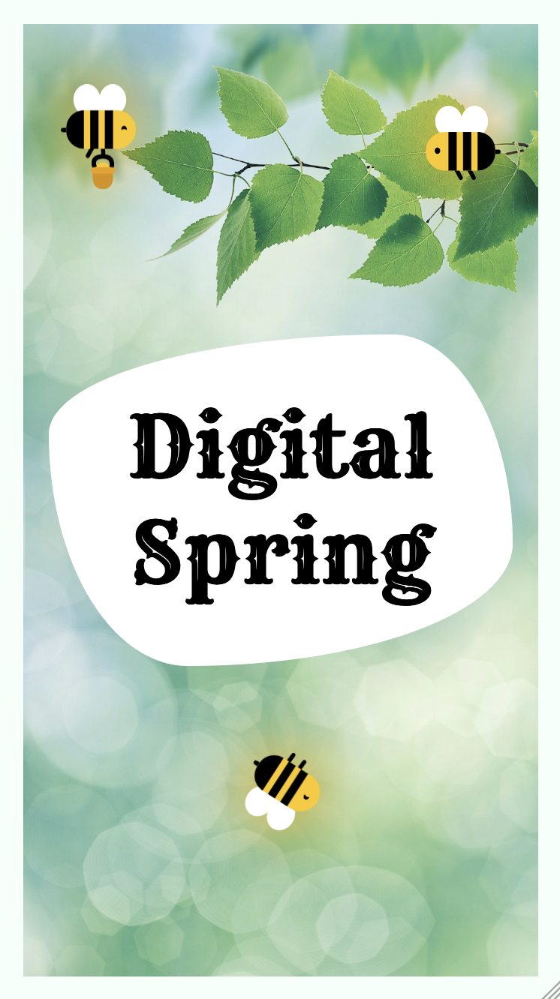

# 🌸 Digital Spring: Embracing New Beginnings 🌸

Welcome to this digital greeting card project! 🎉
We will learn together how to create a greeting card with HTML and CSS (a little bit of JavaScript). 🌼

## What do we want to achieve?

Your greeting card can be a beautiful way to show your care for someone. A greeting card in general can have different layouts. We decided that we want to create **a greeting card with a flip effect**.

Therefore, our **greeting card** will have two sides. The **front side** will show a beautiful image, a greeting text (or something else you want to say) and some animated bees. The **back side** will have your message for the recipient. 💌
Only **one side of the card will be visible** at a time. The recipent needs to click (or touch for mobile devices) the card to flip it. 🔄

During our journey, we will learn more **about HTML, CSS, and a little bit of JavaScript**. We will learn how to **structure our card** with HTML, how to **style** it with CSS, and how to add **animations** to it. 🎨 And we will add a **flipcard effect** to our card with CSS and JavaScript. 🔄

In the end we will have a beautiful greeting card. 🐝

_An example of how the finished greeting card could look like. :)_

## Who do we want to reach with our greeting card?

A greeting card could have multiple purposes: to celebrate a special occasion, to express gratitude, to send well wishes, or to simply say hello. 💌 It is up to you to decide what you want to express with your greeting card. 🌸

But you will show to the recipients of your card that you care about them and that you took the time to create something for them with HTML, CSS, and JavaScript. 🎨

## What do we need to get started?

To create our greeting card, we need a code editor, a web browser, and some images. The basic setup is already created by your coach. You only need to copy the project and can then start coding. 🚀
We have also prepared some images for you. You can use them for your greeting card or you can use your own images. 🖼 And we have also more assets for you: some flowers and bees. 🌼🐝

We will work with an online code editor called **CodeSandbox**. You need to have an account on CodeSandbox to save your project. If you don't have an account yet, you can create one for free.

**Why do we want to use an online editor?**

- CodeSandbox is a nice tool to create and share web projects. 🌐
- We will have an easy way to share our project with others. 🤝

## How is this project structured?

We have set up the project for you and we can start coding right away. 🎉
But let us briefly explain what the files and folders are for. 📁

We prepared already some basic stylings for the greeting card as these are not the main focus of this project and also contains some advanced CSS that we cannot cover during this workshop. 🎨
If you want to look at the styles later, you can find them in the `.where-the-magic-is` folder. 📝

The main files and folder that we will work with are:

- **index.html**: This is the main file of our project. We will structure our greeting card here.
- **styles.css**: This file contains the styles for our greeting card. We will style our card here.
- **index.js**: This file contains the JavaScript code for our greeting card. We will add flip effect here.
- **assets**: Images and all the other assets that you can use for your greeting card are in the `assets` folder. 🖼

The `.gitignore`, `package.json` and `sandbox.config.json` contain some configurations for and information about the project. You don't need to worry about them. 🚀

The `README.md` file contains information about the project. You are reading it right now. 📖

## How can we create our greeting card?

We will create our greeting card step by step. We will start with writing HTML to structure our card, then we will style it with CSS, and finally we will add some animations with CSS and JavaScript. 🎨

#### What is HTML?

**HTML (Hyper Text Markup Language)** is used to express text in a structured way. **HTML tags** indicate what kind of element is displayed on a website.

#### What is CSS?

**CSS (Cascading Style Sheets)** is used to style HTML elements. We will use CSS to make our card look nice.

#### What is JavaScript?

**JavaScript** is used to make websites interactive. We will use JavaScript to add a flip effect to our card.

## Step 1: Structure the greeting card with HTML

## Step 2: Style the greeting card with CSS

## Step 3: Add the flip effect with JavaScript

## Step 4: Add some fun animations

## Step 5: Be creative and make it your own

## Step 6: Share your greeting card

## Credits

- bouquet.jpg - <a href="https://unsplash.com/photos/pink-and-white-flowers-with-green-leaves-6c43FgRt0Dw">Vase of Flowers. Creator: Jan Davidsz de Heem. Date: 1670. Institution: Mauritshuis.</a> Public Domain
- cherry-blossom.jpg - Photo by <a href="https://unsplash.com/@jessicalfadel?utm_content=creditCopyText&utm_medium=referral&utm_source=unsplash">Jessica Fadel</a> on <a href="https://unsplash.com/photos/white-cherry-blossom-under-blue-sky-during-daytime-ikm9mXRREw4?utm_content=creditCopyText&utm_medium=referral&utm_source=unsplash">Unsplash</a>
- curious-deer.jpg - Photo by <a href="https://unsplash.com/@agathe_26?utm_content=creditCopyText&utm_medium=referral&utm_source=unsplash">Agathe</a> on <a href="https://unsplash.com/photos/brown-deer-mdSz_AY5Hi8?utm_content=creditCopyText&utm_medium=referral&utm_source=unsplash">Unsplash</a>
- dandelions.jpg - Photo by <a href="https://unsplash.com/@niklas_hamann?utm_content=creditCopyText&utm_medium=referral&utm_source=unsplash">Niklas Hamann</a> on <a href="https://unsplash.com/photos/yellow-petaled-flower-lot-during-daytime-uDY-h_z4XlQ?utm_content=creditCopyText&utm_medium=referral&utm_source=unsplash">Unsplash</a>
- green-leaves.jpg - Photo by <a href="https://unsplash.com/@dtolokonov?utm_content=creditCopyText&utm_medium=referral&utm_source=unsplash">Dmytro Tolokonov</a> on <a href="https://unsplash.com/photos/tree-leaves-macro-photography-Jq3WI9IQgEs?utm_content=creditCopyText&utm_medium=referral&utm_source=unsplash">Unsplash</a>
- flower-details.jpg - Photo by <a href="https://unsplash.com/@timothycdykes?utm_content=creditCopyText&utm_medium=referral&utm_source=unsplash">Timothy Dykes</a> on <a href="https://unsplash.com/photos/yellow-flower-in-close-up-photography-wrZiQTfH2UQ?utm_content=creditCopyText&utm_medium=referral&utm_source=unsplash">Unsplash</a>
- flowering-trees.jpg - Photo by <a href="https://unsplash.com/@dulcineiadias?utm_content=creditCopyText&utm_medium=referral&utm_source=unsplash">Dulcineia Dias</a> on <a href="https://unsplash.com/photos/white-petal-flowers-shallow-focus-photography-HQOA0LA91As?utm_content=creditCopyText&utm_medium=referral&utm_source=unsplash">Unsplash</a>
- orange-flowers.jpg - Photo by <a href="https://unsplash.com/@monstercritic?utm_content=creditCopyText&utm_medium=referral&utm_source=unsplash">Sergey Shmidt</a> on <a href="https://unsplash.com/photos/orange-petaled-flowers-koy6FlCCy5s?utm_content=creditCopyText&utm_medium=referral&utm_source=unsplash">Unsplash</a>
- pink-flowers.jpg - Photo by <a href="https://unsplash.com/@babybluecat?utm_content=creditCopyText&utm_medium=referral&utm_source=unsplash">J Lee</a> on <a href="https://unsplash.com/photos/pink-flowers-in-tilt-shift-lens-0lL6Sox7n1Y?utm_content=creditCopyText&utm_medium=referral&utm_source=unsplash">Unsplash</a>
- pink-wall.jpg - Photo by <a href="https://unsplash.com/@joyful_gabby?utm_content=creditCopyText&utm_medium=referral&utm_source=unsplash">Gabrielle Audu</a> on <a href="https://unsplash.com/photos/purple-and-yellow-flowers-in-brown-clay-pots-SWAI1t-kjkY?utm_content=creditCopyText&utm_medium=referral&utm_source=unsplash">Unsplash</a>
- sunny-field.jpg - Photo by <a href="https://unsplash.com/@macedorafs?utm_content=creditCopyText&utm_medium=referral&utm_source=unsplash">Rafael Macedo</a> on <a href="https://unsplash.com/photos/wheat-field-kR3ZIZ6cGcI?utm_content=creditCopyText&utm_medium=referral&utm_source=unsplash">Unsplash</a>
